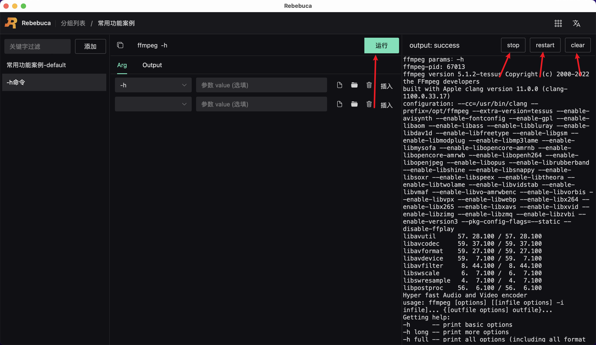

# ffmpeg命令[运行-停止-重启-清除输出日志]

## 运行ffmpeg命令

如下图所示：

操作步骤：

1. 点击运行按钮
2. 右侧会立刻打印运行日志
3. 运行成功且完成， output 后会展示 success ； 运行中， output 后会展示 running； 运行失败， output 后会展示 failed；

## 停止ffmpeg命令

操作步骤：

1. 点击 stop 按钮，即可停止当前 ffmpeg 命令的运行，也就是杀掉了当前 ffmpeg 命令运行的进程

## 重启ffmpeg命令

操作步骤：

1. 点击 restart 按钮，即可杀掉当前 ffmpeg 命令进程，同时重新运行该 ffmpeg 命令

## 清除ffmpeg命令输出日志

操作步骤：

1. 点击 clear 按钮，即可清除当前 ffmpeg 命令的输出日志
