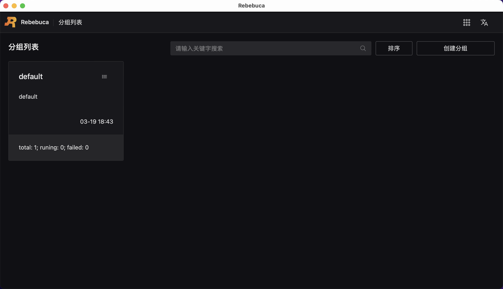
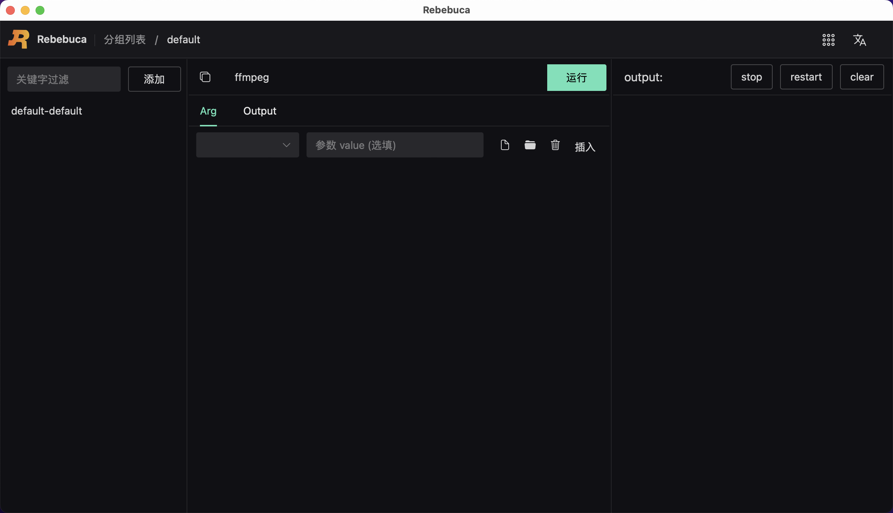
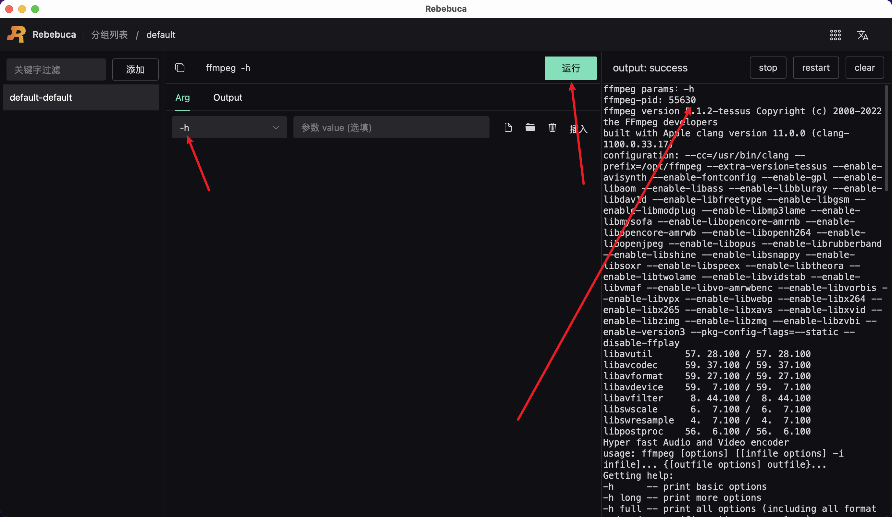

# 快速起步

## 安装

- Windows 下载地址：[rebebuca.msi](https://gitee.com/cuteyk/rebebuca-update/releases/download/1.0.0/Rebebuca.msi)
- Mac 安装下载地址：[rebebuca.dmg](https://gitee.com/cuteyk/rebebuca-update/releases/download/1.0.0/Rebebuca.dmg)
- Mac(arm64) 安装下载地址：[rebebuca.dmg](https://gitee.com/cuteyk/rebebuca-update/releases/download/1.0.0/Rebebuca-aarch64.dmg)
- Linux 下载地址：[rebebuca_amd64.deb](https://gitee.com/cuteyk/rebebuca-update/releases/download/1.0.0/rebebuca_amd64.deb)

## 启动软件

下载完成后，启动 rebebuca ，会出现下图所示界面：

点击 default 分组，进入详情页，如下图所示：

在 Arg tab 下选择 -h 参数，然后点击运行，如下图所示：

查看右边输出日志，向下滑动到底部，即可发现运行成功。

至此， Rebebuca 的最基本使用已经完成。

