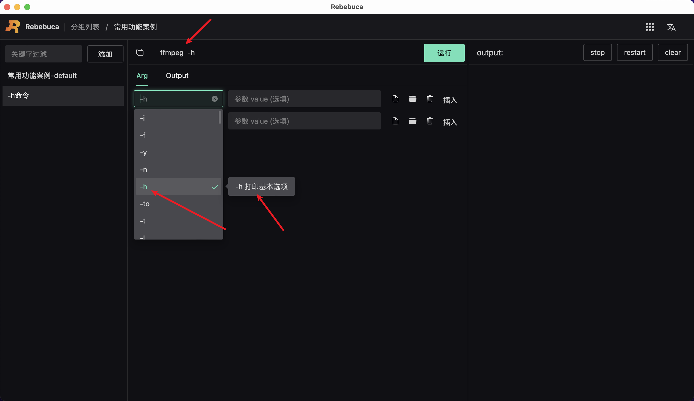
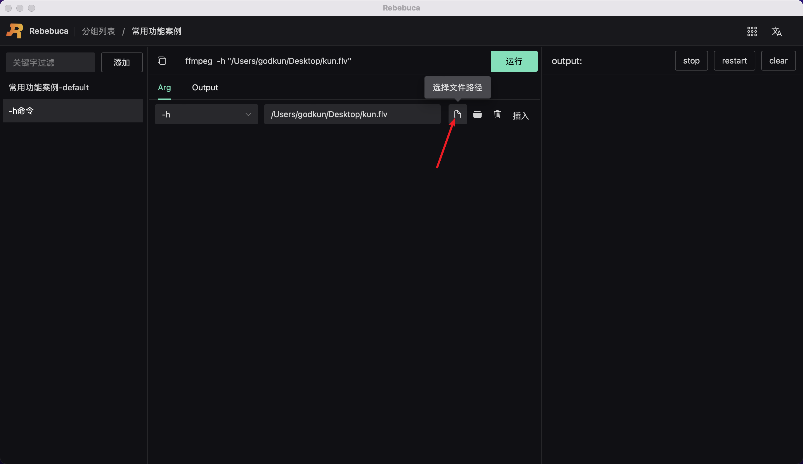
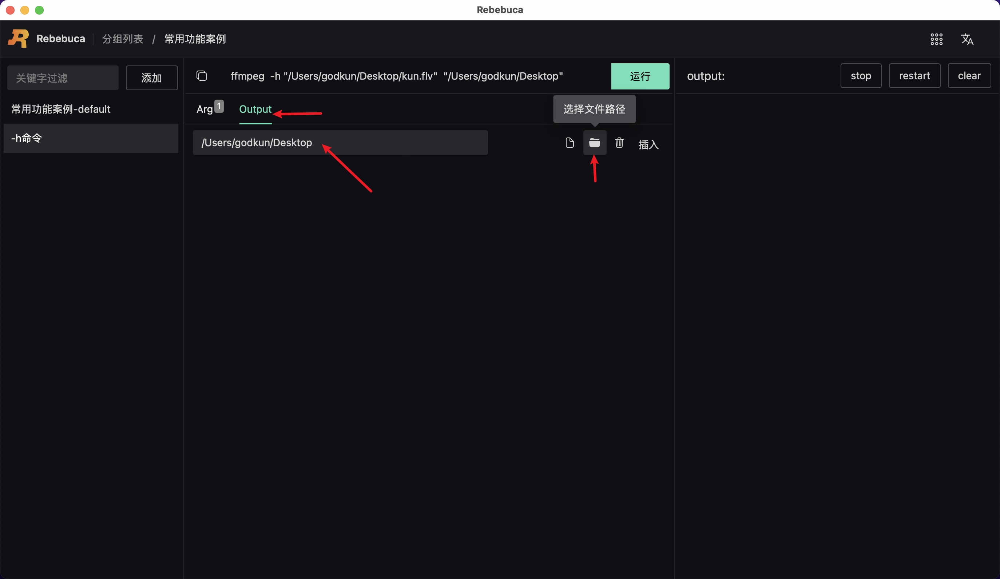
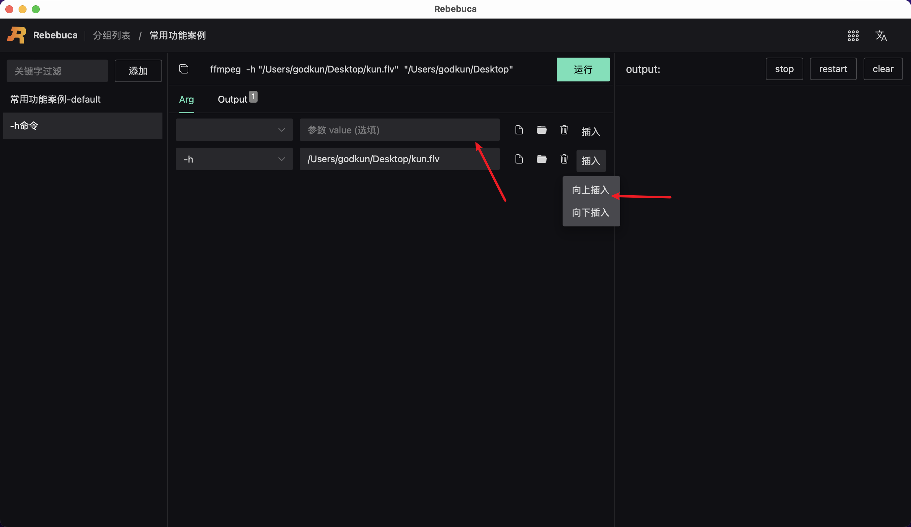
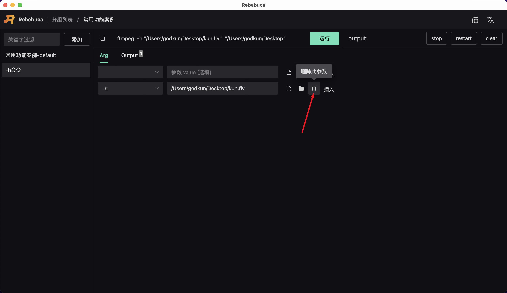

# 新增-编辑-插入-删除ffmpeg命令参数

新建命令后，我们就可以对该命令进行动态参数配置

## 新建ffmpeg命令参数

如下图所示：

操作步骤：

1. 点击下拉框，既可以下拉选择 ffmpeg 参数，也可以手动输入参数关键字，支持模糊匹配。同时鼠标悬浮，右侧会有参数解释提示
2. 如果没有找到你想要的参数，可以直接输入你的参数
3. 输入参数 key 后，如果该参数无 value ，则 value 输入框不填
4. 输入参数 key 后，如果该参数有 value ，则在 value 输入框中输入 value ， 如输入了 -i 参数， 则需要指定输入文件路径，这时我们可以点击右侧的选择文件路径按钮，来选择我们的输入文件，如视频文件，效果图如下：

5. 输入参数后，如果存在输出对象，如下图所示： 需要点击 Output Tab ， 输入输出值，我们可以点击右侧选择文件路径按钮，来选择输出对象的目录，选择好后，我们再在目录路径后面定义好我们的输出文件名和格式

至此，完成新建 ffmpeg 命令参数操作。

## 编辑ffmpeg命令参数

直接对已经存在的参数进行编辑即可

## 插入ffmpeg命令参数

如下图所示：

操作步骤：

1. 点击右侧插入按钮，选择向上插入或向下插入
2. 当前参数的上面或下面或多出一个空的参数选型

至此，完成插入ffmpeg命令参数操作。

## 删除ffmpeg命令参数

如下图所示：

操作步骤：

1. 点击右侧删除按钮，删除按钮会变成感叹号，此时，再次点击才能删除

至此，完成删除ffmpeg命令参数操作。

