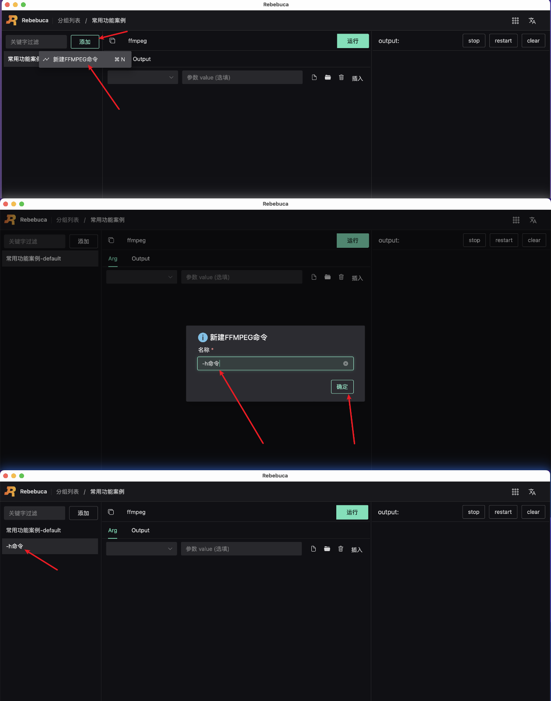
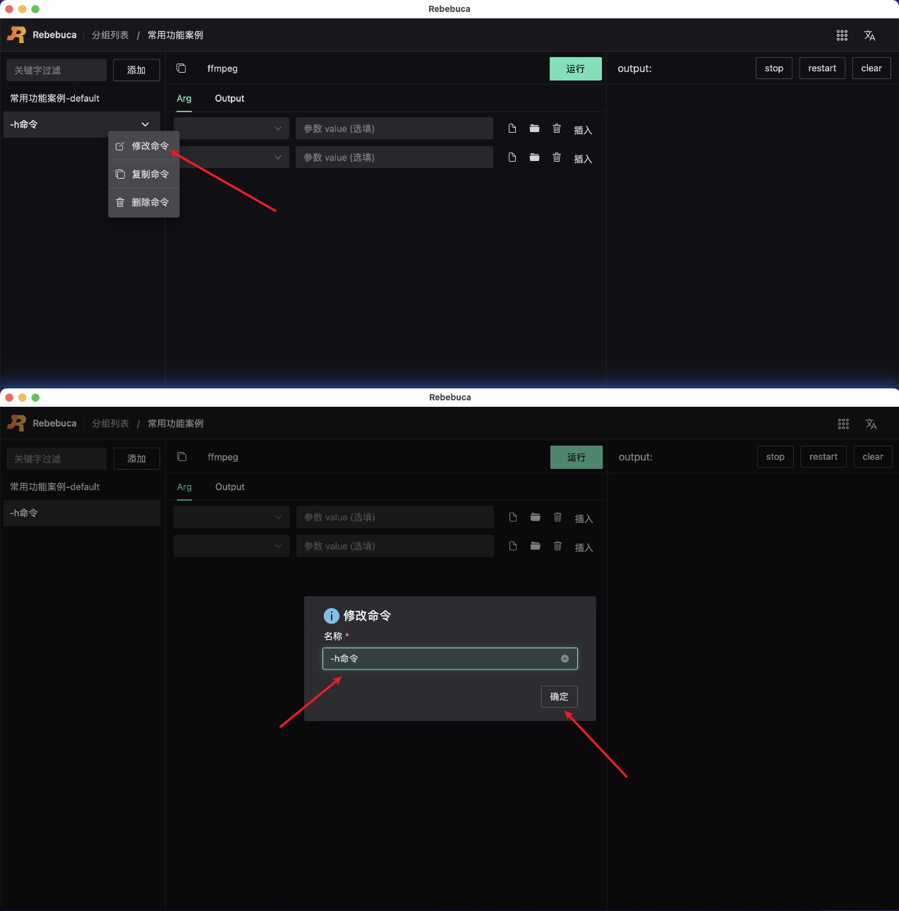

# 新建-编辑-复制-删除ffmpeg命令

## 新建命令

进入常用功能案例分组详情

如下图所示：

操作步骤：

1. 鼠标移动到添加按钮上
2. 点击新建FFMPEG命令
3. 弹出命令新建弹窗，输入命令名称（如-h命令、视频剪切、推流、拉流等）
4. 点击确定，完成命令新建

至此，完成新建命令操作。

## 编辑命令

如下图所示：

操作步骤：

1. 鼠标点击命令向下箭头
2. 点击修改配置
3. 弹出命令修改弹窗，可对名称进行修改
4. 点击确定，完成修改

至此，完成修改命令操作。

## 复制命令

图省略。

操作步骤：

1. 鼠标点击命令向下箭头
2. 点击复制命令
3. 弹出修改命令弹窗，修改命令名称
4. 点击确定，完成复制，该复制操作，会将命令的 ffmpeg 参数也全部复制。

至此，完成复制命令操作。

## 删除命令

图省略。

操作步骤：

1. 鼠标点击命令向下箭头
2. 点击删除命令
3. 弹出删除弹窗
4. 点击确定，完成删除

至此，完成删除命令操作。

