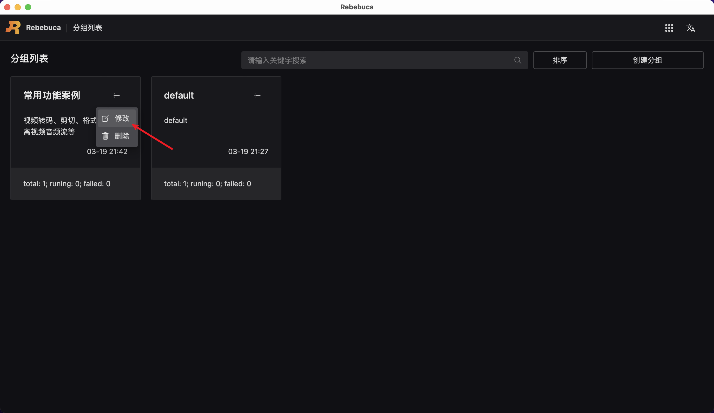
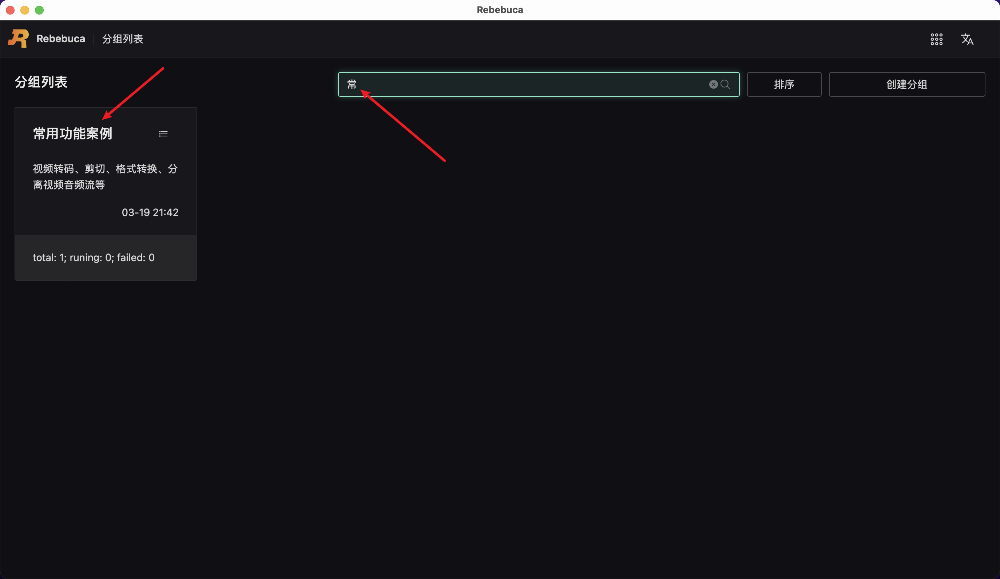
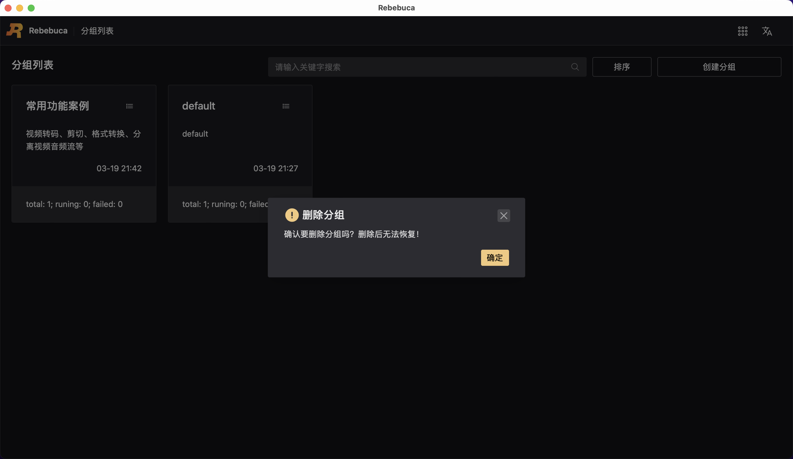

# 新建-编辑-查找-删除分组

## 新建分组

启动软件后，默认会有一个分组，名叫 default ， 我们可以新建分组。

如下图所示：

操作步骤：

1. 点击新建分组
2. 输入分组名称（必填）、分组描述（选填）
3. 点击确定

至此，完成新建分组操作。

## 编辑分组

如下图所示：

操作步骤：

1. 鼠标移动到分组操作图标上
2. 点击修改
3. 弹出分组修改弹窗，可对分组名称、分组描述进行修改
4. 点击确定，完成修改，或者点击蒙层，关闭弹窗，取消修改

至此，完成编辑分组操作。

## 查找分组

如下图所示：

操作步骤：

1. 在搜索框中输入常
2. 会自动模糊查找名称包含常字的分组

至此，完成查找分组操作。

## 删除分组

如下图所示：

操作步骤：

1. 鼠标移动到分组操作图标上
2. 点击删除
3. 弹出删除分组弹窗，点击确定，完成删除，或者点击叉号，取消删除

至此，完成删除分组操作。

