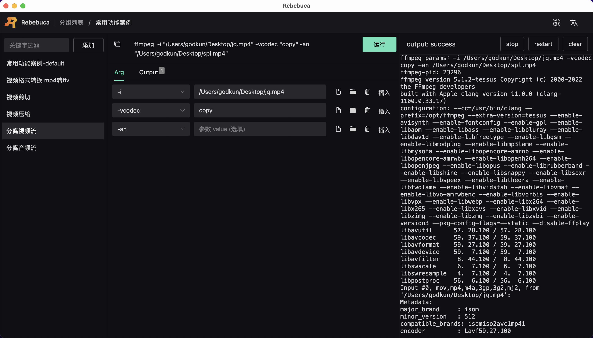

# 案例-分离视频音频流

## 分离视频流


如下图所示：



整体命令如下

```sh
ffmpeg  -i "/Users/godkun/Desktop/jq.mp4" -vcodec "copy" -an  "/Users/godkun/Desktop/spl.mp4"
```

操作步骤：

1. 新建视频剪切命令
2. 参考上图，完成 Arg tab 参数的设置
3. 完成 Output tab 输出值的设置
4. 点击运行按钮，进行命令运行，等待运行结束，如显示成功，则表示分离视频流成功


## 分离音频流


如下图所示：


整体命令如下

```sh
ffmpeg  -i "/Users/godkun/Desktop/jq.mp4" -acodec "copy" -vn  "/Users/godkun/Desktop/ypl.mp4"
```

操作步骤：

1. 新建视频剪切命令
2. 参考上图，完成 Arg tab 参数的设置
3. 完成 Output tab 输出值的设置
4. 点击运行按钮，进行命令运行，等待运行结束，如显示成功，则表示分离音频流成功


最终输出对象如下图所示：


至此，分离视频音频流案例介绍完毕。
