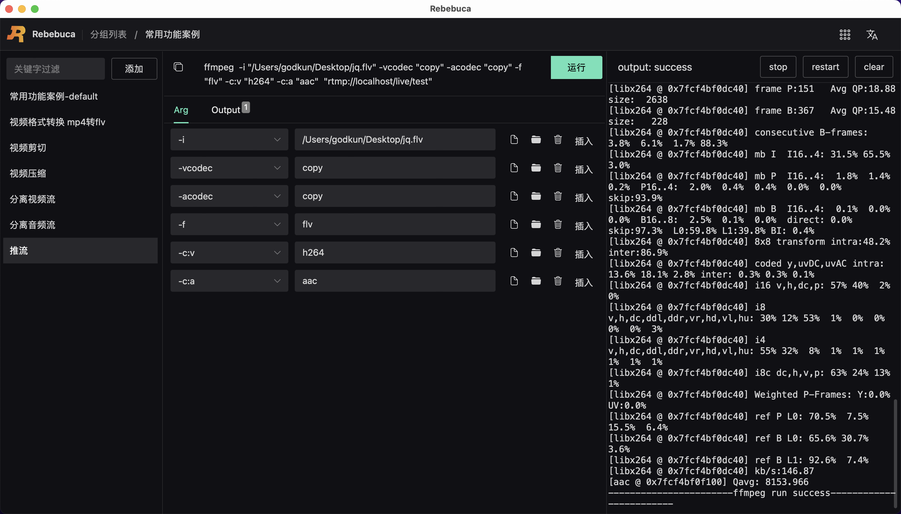
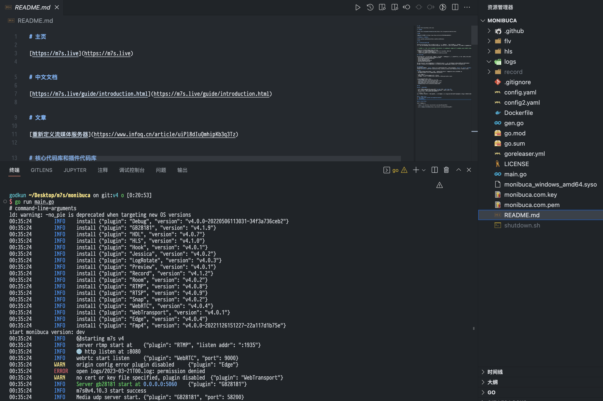

# 案例-推流

如下图所示：



整体命令如下

```sh
ffmpeg  -i "/Users/godkun/Desktop/jq.flv" -vcodec "copy" -acodec "copy" -f "flv" -c:v "h264" -c:a "aac"  "rtmp://localhost/live/test"
```

操作步骤：

1. 新建视频剪切命令
2. 参考上图，完成 Arg tab 参数的设置
3. 完成 Output tab 输出值的设置
4. 点击运行按钮，进行命令运行，等待运行结束，如显示成功，则表示推流成功


这里的推流地址是通过启动 Monibuca 来生成的。

Monibuca 官网: https://m7s.live

启动效果图如下：




至此，推流案例介绍完毕。
