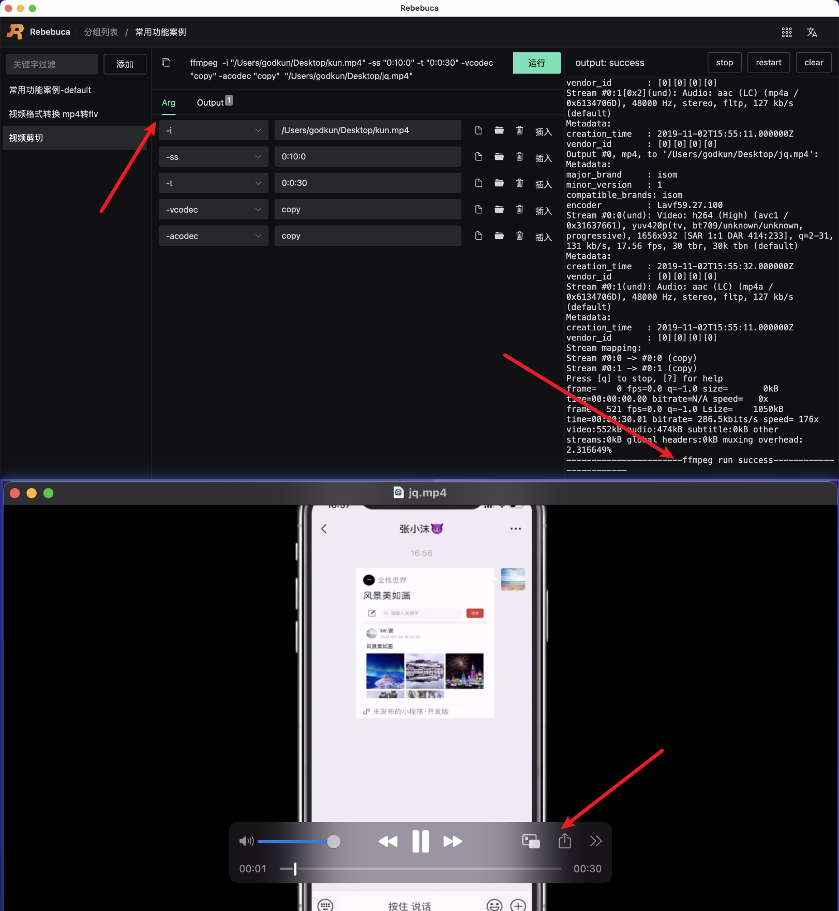

# 案例-视频剪切

如下图所示：



整体命令如下

```sh
ffmpeg  -i "/Users/godkun/Desktop/kun.mp4" -ss "0:10:0" -t "0:0:30" -vcodec "copy" -acodec "copy"  "/Users/godkun/Desktop/jq.mp4"
```

命令含义： 对 kun.mp4 进行原装剪切，剪切开始时间是第 10 分钟，剪切时长是 30 秒。输出对象是 jq.mp4

操作步骤：

1. 新建视频剪切命令
2. 参考上图，完成 Arg tab 参数的设置
3. 完成 Output tab 输出值的设置
4. 点击运行按钮，进行命令运行，等待运行结束，如显示成功，则表示剪切成功


从上图可以可以看到输出对象 jq.mp4 时长为 30 秒。

至此，视频格式剪切案例介绍完毕。

