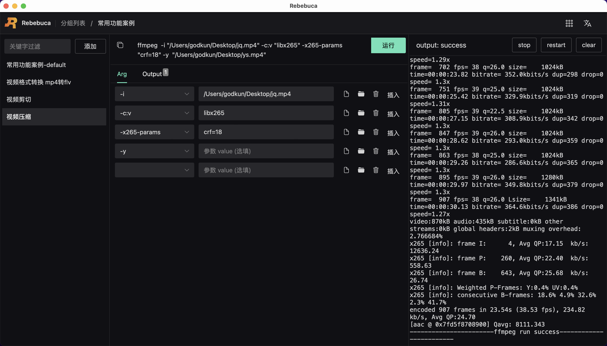

# 案例-视频压缩

如下图所示：



整体命令如下

```sh
ffmpeg  -i "/Users/godkun/Desktop/jq.mp4" -c:v "libx265" -x265-params "crf=18" -y  "/Users/godkun/Desktop/ys.mp4"
```

操作步骤：

1. 新建视频剪切命令
2. 参考上图，完成 Arg tab 参数的设置
3. 完成 Output tab 输出值的设置
4. 点击运行按钮，进行命令运行，等待运行结束，如显示成功，则表示压缩成功

至此，视频压缩案例介绍完毕。

