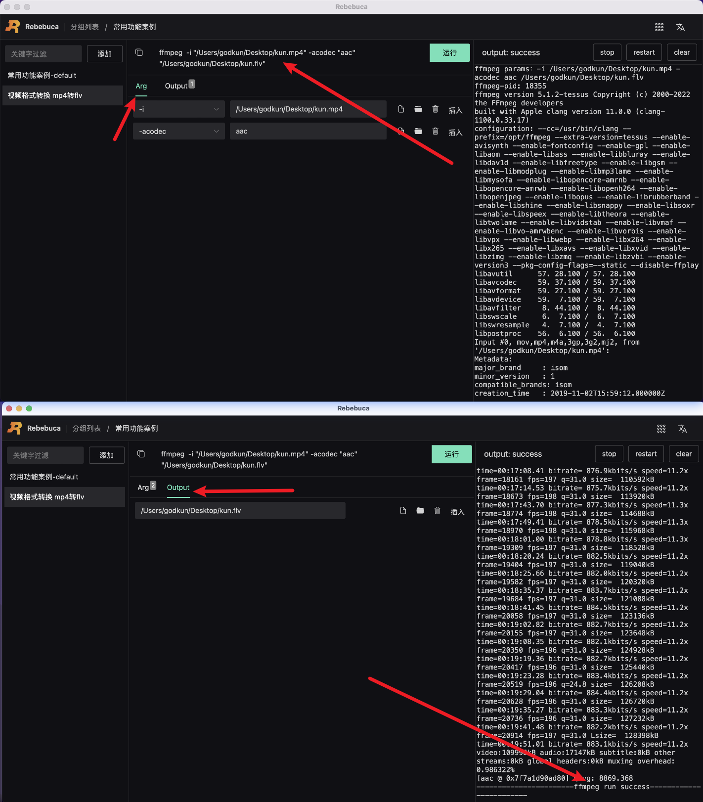

# 案例-视频格式转换

## 将 mp4 格式转换成 flv 格式

如下图所示：



整体命令如下

```sh
ffmpeg  -i "/Users/godkun/Desktop/kun.mp4" -acodec "aac" "/Users/godkun/Desktop/kun.flv"
```

操作步骤：

1. 新建视频格式转换命令
2. 在 Arg tab 下输入 -i 参数，点击选择文件，选中需要输入的文件，如 /Users/godkun/Desktop/kun.mp4
3. 在 Arg tab 下输入 -acodec 参数，值输入 aac
4. 在 Output tab 下点击选择文件夹路径，确定输出文件的目录，如 /Users/godkun/Desktop/
5. 在 Output tab 对选中的输出文件目录进行添加文件名，最终输出值为 /Users/godkun/Desktop/kun.flv
6. 点击运行按钮，进行命令运行，等待运行结束，如显示成功，则表示转换成功

至此，视频格式转换案例介绍完毕。
